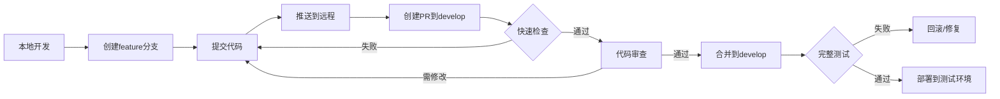
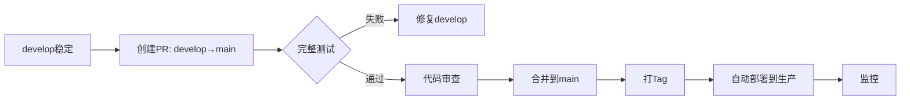

# 🌳 Banana Slides Git工作流 + CI/CD规范

## 📋 分支策略

我们采用 **GitHub Flow** 简化工作流，适合持续部署的Web应用。

### 分支类型

| 分支类型 | 命名规范 | 用途 | CI/CD策略 | 保护规则 |
|---------|---------|------|-----------|---------|
| `main` | `main` | 生产环境代码 | ✅ 完整测试 + 自动部署 | 🔒 强保护 |
| `develop` | `develop` | 开发环境代码 | ✅ 完整测试 | 🔒 中等保护 |
| `feature/*` | `feature/功能名` | 新功能开发 | ✅ 快速检查 | ⚠️ 无保护 |
| `fix/*` | `fix/bug描述` | Bug修复 | ✅ 快速检查 | ⚠️ 无保护 |
| `hotfix/*` | `hotfix/紧急修复` | 生产紧急修复 | ✅ 完整测试 | ⚠️ 需要审核 |

---

## 🔄 完整开发流程

### 场景1：开发新功能

```bash
# 1. 从develop创建功能分支
git checkout develop
git pull origin develop
git checkout -b feature/add-ai-image-edit

# 2. 开发并提交
git add .
git commit -m "feat: 添加AI图片编辑功能"

# 3. 推送到远程（触发PR快速检查）
git push origin feature/add-ai-image-edit

# 4. 在GitHub创建PR: feature/xxx -> develop
#    - CI自动运行：快速检查（Lint + 构建 + 冒烟测试）
#    - 时间：2-3分钟
#    - 通过后请求代码审查

# 5. 代码审查通过，合并到develop
#    - CI自动运行：完整测试套件
#    - 时间：10-15分钟
#    - 包含：单元测试 + 集成测试 + Docker测试 + E2E测试

# 6. 测试环境自动部署（可选）
```

### 场景2：发布到生产

```bash
# 1. develop稳定后，创建PR: develop -> main
#    - CI自动运行：完整测试 + 安全扫描

# 2. 测试通过，代码审查通过，合并到main
#    - CI自动运行：完整测试
#    - 自动构建Docker镜像
#    - 自动部署到生产环境（或等待手动确认）

# 3. 打Tag标记版本
git tag -a v0.1.0 -m "Release v0.1.0"
git push origin v0.1.0
```

### 场景3：紧急修复生产Bug

```bash
# 1. 从main创建hotfix分支
git checkout main
git pull origin main
git checkout -b hotfix/fix-export-crash

# 2. 修复并测试
git add .
git commit -m "fix: 修复导出PPTX崩溃问题"

# 3. 推送并创建PR: hotfix/xxx -> main
git push origin hotfix/fix-export-crash

# 4. CI完整测试通过，紧急合并
#    - 需要至少1人审查
#    - 合并后自动部署

# 5. 同步回develop
git checkout develop
git merge main
git push origin develop
```

---

## 🚀 CI/CD触发策略

### PR快速检查（2-3分钟）

**触发条件：** 任何PR创建或更新

```yaml
on:
  pull_request:
    branches: [ main, develop ]
```

**执行内容：**
- ✅ Lint检查（代码格式）
- ✅ 构建检查（编译是否成功）
- ✅ 冒烟测试（基本API能否启动）

**目的：** 快速反馈，避免明显错误

---

### 完整测试（10-15分钟）

**触发条件：** 
- Push到 `main` 分支
- Push到 `develop` 分支
- PR合并到 `main` 或 `develop`

```yaml
on:
  push:
    branches: [ main, develop ]
  pull_request:
    branches: [ main, develop ]
```

**执行内容：**
- ✅ 后端单元测试（覆盖率 ≥80%）
- ✅ 后端集成测试（所有API端点）
- ✅ 前端单元测试（组件测试）
- ✅ Docker环境测试（容器化部署）
- ✅ E2E测试（核心用户流程）
- ✅ 安全扫描（依赖漏洞）

**目的：** 保证代码质量，防止破坏性更改

---

### 自动部署

**触发条件：**
- `main` 分支测试通过 → 生产环境
- `develop` 分支测试通过 → 测试环境（可选）

---

## 🔒 分支保护规则

### main分支（生产环境）

在GitHub Settings → Branches → Branch protection rules 设置：

```yaml
分支: main

保护规则:
☑ Require a pull request before merging
  ☑ Require approvals: 1
  ☑ Dismiss stale pull request approvals when new commits are pushed
  ☑ Require review from Code Owners

☑ Require status checks to pass before merging
  ☑ Require branches to be up to date before merging
  必需的检查:
    - 后端单元测试
    - 后端集成测试
    - 前端测试
    - Docker环境测试
    - E2E测试

☑ Require conversation resolution before merging

☑ Require signed commits (推荐)

☑ Include administrators (管理员也必须遵守规则)

☑ Restrict who can push to matching branches
  允许: 仅维护者

☑ Allow force pushes: ❌ 禁止
☑ Allow deletions: ❌ 禁止
```

### develop分支（开发环境）

```yaml
分支: develop

保护规则:
☑ Require a pull request before merging
  ☑ Require approvals: 1 (可选，小团队可以不要求)

☑ Require status checks to pass before merging
  必需的检查:
    - 快速检查
    - 后端单元测试
    - 前端测试

☑ Allow force pushes: ❌ 禁止
☑ Allow deletions: ❌ 禁止
```

---

## 📝 Commit规范

使用 **Conventional Commits** 规范：

```bash
<type>(<scope>): <subject>

<body>

<footer>
```

### Type类型

| Type | 说明 | 示例 |
|------|------|------|
| `feat` | 新功能 | `feat: 添加AI图片编辑功能` |
| `fix` | Bug修复 | `fix: 修复PPTX导出崩溃` |
| `docs` | 文档更新 | `docs: 更新API文档` |
| `style` | 代码格式（不影响功能） | `style: 格式化代码` |
| `refactor` | 重构（不是新功能也不是修复） | `refactor: 重构AI服务` |
| `perf` | 性能优化 | `perf: 优化图片生成速度` |
| `test` | 测试相关 | `test: 添加单元测试` |
| `chore` | 构建/工具链 | `chore: 更新依赖` |
| `ci` | CI/CD相关 | `ci: 添加E2E测试` |

### 示例

```bash
# 好的commit
feat(backend): 添加素材管理API
fix(frontend): 修复模板上传415错误
docs(readme): 更新Docker部署说明
test(e2e): 添加完整PPT生成流程测试

# 不好的commit
update files
fix bug
修改
```

---

## 🎯 PR模板

创建 `.github/pull_request_template.md`：

```markdown
## 📝 变更说明

<!-- 简要描述本PR的目的 -->

## 🔗 相关Issue

Closes #(issue编号)

## ✅ 变更类型

- [ ] 新功能 (feature)
- [ ] Bug修复 (fix)
- [ ] 文档更新 (docs)
- [ ] 代码重构 (refactor)
- [ ] 性能优化 (perf)
- [ ] 测试相关 (test)

## 🧪 测试

- [ ] 已添加单元测试
- [ ] 已添加集成测试
- [ ] 已手动测试
- [ ] CI测试通过

## 📸 截图（如果适用）

<!-- 添加截图或GIF -->

## ✋ 检查清单

- [ ] 代码遵循项目规范
- [ ] 已更新相关文档
- [ ] 通过Lint检查
- [ ] 无新的警告或错误
- [ ] 已自我审查代码
```

---

## 🚦 实际工作流示例

### 团队日常开发



### 发布流程



---

## 💡 最佳实践

### 1. 小而频繁的提交
```bash
# 好：功能拆分，每个commit做一件事
git commit -m "feat: 添加素材上传API"
git commit -m "feat: 添加素材列表查询"
git commit -m "test: 添加素材API测试"

# 不好：大而全的提交
git commit -m "添加素材功能"  # 包含了10个文件的修改
```

### 2. 及时同步主分支
```bash
# 每天开始工作前
git checkout develop
git pull origin develop

# 功能分支定期同步
git checkout feature/my-feature
git merge develop  # 或者 git rebase develop
```

### 3. PR保持小巧
- 单个PR改动 < 400行代码
- 单个PR解决单个问题
- 便于代码审查

### 4. 充分利用CI反馈
```bash
# Push前本地检查
npm run lint
npm test
pytest

# 推送后立即查看CI状态
# 失败立即修复，不要堆积
```

### 5. 代码审查要点
- [ ] 功能是否符合需求
- [ ] 代码是否清晰易懂
- [ ] 是否有潜在bug
- [ ] 是否有测试覆盖
- [ ] 是否影响性能
- [ ] 是否有安全隐患

---

## 📚 参考资料

- [GitHub Flow](https://docs.github.com/en/get-started/quickstart/github-flow)
- [Conventional Commits](https://www.conventionalcommits.org/)
- [Branch Protection Rules](https://docs.github.com/en/repositories/configuring-branches-and-merges-in-your-repository/managing-protected-branches/about-protected-branches)

---

## 🆘 常见问题

### Q: feature分支要跑完整测试吗？
A: 不需要。feature分支只跑快速检查（2-3分钟），合并到develop后才跑完整测试。

### Q: 可以直接push到develop吗？
A: 不可以。必须通过PR，确保代码审查和CI检查。

### Q: CI失败了怎么办？
A: 
1. 查看失败原因
2. 本地修复并测试
3. 提交修复并推送
4. CI会自动重新运行

### Q: 紧急修复可以跳过CI吗？
A: 不可以。但可以：
1. 并行进行修复和测试
2. 使用hotfix流程快速合并
3. 关键人员快速审查

### Q: develop和main应该多久同步一次？
A: 
- 小功能：1-2周
- 大版本：按milestone
- 紧急修复：立即

---

**最后更新：** 2025-12-07

